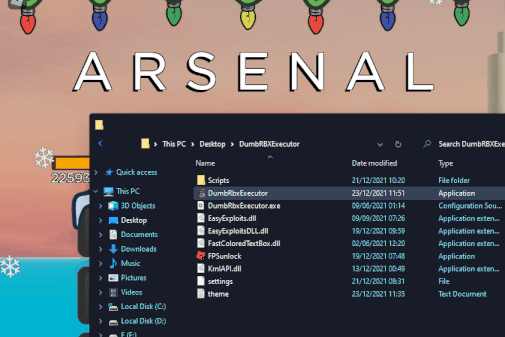

# DumbRobloxExecutor
a dumb roblox executor i came up with, the API's it uses are not mine- this was just to learn some more things in c#

# new stuff i tried with this

> - attempted an overlay styled form
> - tried to mitigate annoying popups from easyexploit api by forcing roblox to foreground after injecting
> - hide/show hotkey for menu
> - a few other useless but quirky things

# Everything here is easy to find info about on the internet, if you actually waste your time to decompile it, you will be dissappointed
# Enjoy or.. Dont enjoy this dumb cheat for roblox

